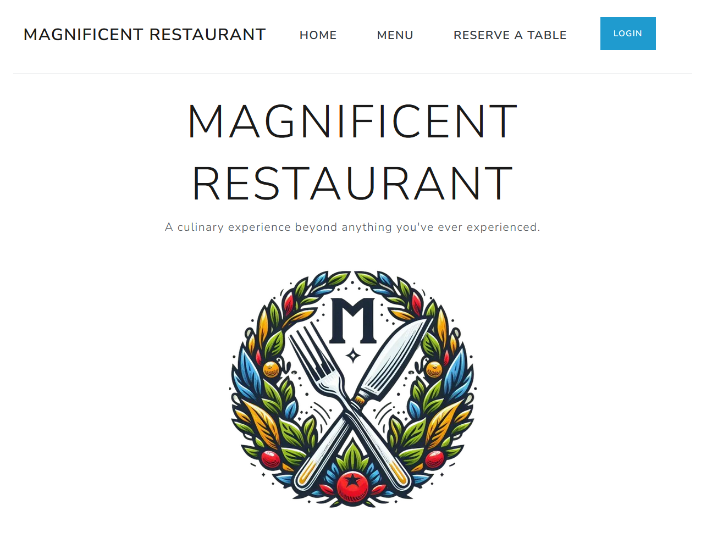

# Reliable Reservations Web Portal

&nbsp;

  

  

&nbsp;

## 🔭 Overview

This ASP.NET Core MVC application serves as the primary web frontend for Magnificent Restaurant, offering both a public-facing website for customers and an admin interface for restaurant management.

&nbsp;

## ✨ Features

- 🏠 Public-facing Website for Customers

- 🍽️ Menu Display and Management

- 🔐 Secure Authentication for Admin Access

- 📋 Reservation Management

- 👥 Customer Data Management

- 📅 Integration with Reservation System

- 🎨 Responsive Design for Various Devices

&nbsp;

## ⚙️ Prerequisites

- .NET 6.0 SDK or later
- Visual Studio 2022 or Visual Studio Code

 
&nbsp;

## 🛠️ Technologies Used

- ⚙️ ASP.NET Core MVC

- 🎨 Bootstrap

- 📜 jQuery

- 🗓️ Flatpickr (for date picking)

- 🔌 Integration with RESTful API backend

&nbsp;

---

Thank you for exploring the Reliable Reservations Web Portal! This web application works in conjunction with the Reliable Reservations Client and my backend API system to provide a complete restaurant management and customer engagement solution.